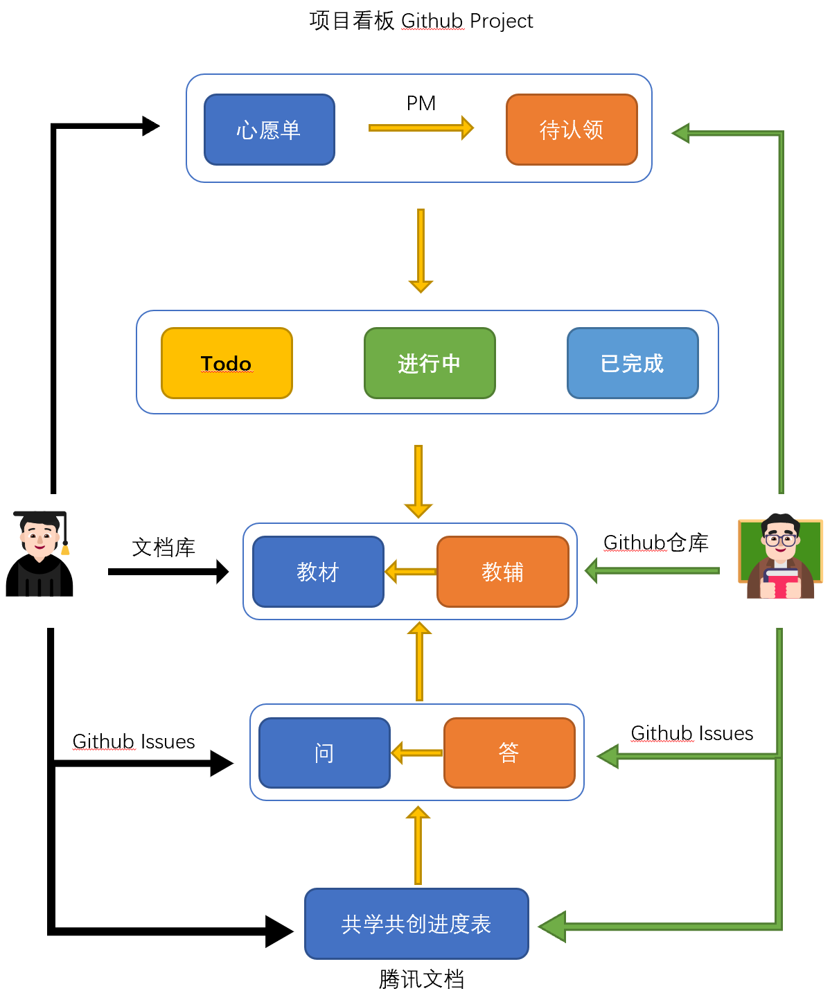

## 协作流程

快速入口：[文档库](https://coding-newbies-group.github.io/programming-co_creation-docs/docs/intro/) | [仓库](https://github.com/coding-newbies-group/programming-co_creation-docs) | [Github Issues](https://github.com/coding-newbies-group/programming-co_creation-docs/issues) | [共学共创进度表](https://docs.qq.com/sheet/DYkdIT0hKbW1tWmhE?tab=BB08J2) | [项目看板](https://github.com/orgs/coding-newbies-group/projects/1) | [常见问题](https://coding-newbies-group.github.io/programming-co_creation-docs/docs/files/qa)

## 课程大纲

### 准备篇
0-1.[前期准备](https://coding-newbies-group.github.io/programming-co_creation-docs/docs/windows/p0/p0-0-prep)

0-2.[通过Github提交问题](https://coding-newbies-group.github.io/programming-co_creation-docs/docs/windows/p0/p0-4-issues) | [视频](https://www.bilibili.com/video/BV1V24y1H73p/?vd_source=4a888db8814702b2062fcaf2575be745)

0-3.[Markdown超简教程](https://coding-newbies-group.github.io/programming-co_creation-docs/docs/windows/p0/p0-2-markdown)（新手非必须） | [视频](https://www.bilibili.com/video/BV1Ho4y1v79V/?vd_source=4a888db8814702b2062fcaf2575be745)

0-4.[通过Github共创](https://www.bilibili.com/video/BV1S54y1w7XN/?vd_source=4a888db8814702b2062fcaf2575be745)（新手非必须） | [视频](https://www.bilibili.com/video/BV1S54y1w7XN/?vd_source=4a888db8814702b2062fcaf2575be745)

0-5.[使用命令行](https://coding-newbies-group.github.io/programming-co_creation-docs/docs/windows/p0/p0-1-cli) | [视频](https://www.bilibili.com/video/BV1Jo4y1Y7SC/?vd_source=4a888db8814702b2062fcaf2575be745)

### 基础篇
第一章 理解编程语言

第二章 程序的基本结构（一）：值与变量

第三章 程序的基本结构（二）：操作符与函数

第四章 程序的基本结构（三）：逻辑判断与分支

第五章 程序的基本结构（四）：循环

第六章 程序的基本结构（五）：异常处理

第七章 理解对象与类：起源篇

第八章 理解对象与类：概念篇

第九章 理解对象与类：Python 篇

第十章 字符与字符串

最十一章 课程练习

