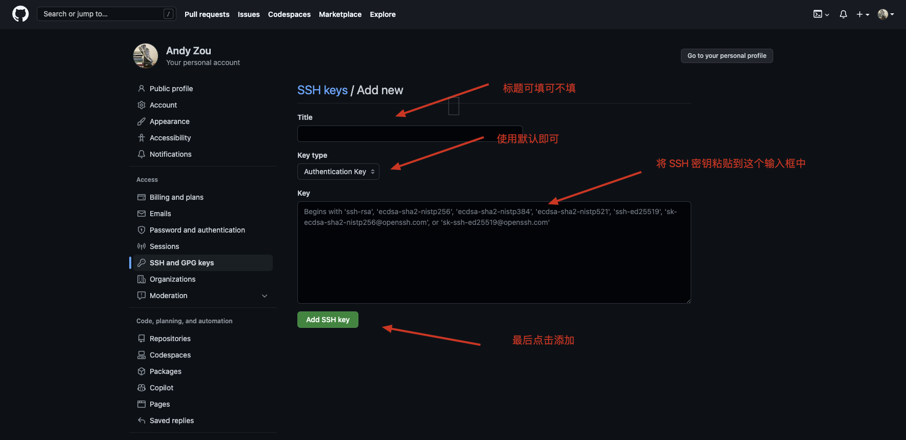

> [视频](https://www.bilibili.com/video/BV1S54y1w7XN/?vd_source=4a888db8814702b2062fcaf2575be745)

# 通过Github共创(新手可选项)


## 安装Git

[https://git-scm.com/](https://git-scm.com/)

命令行如果输入`git`有返回，表示安装成功


## 为Github配置SSH登录

注意：以下步骤中使用的所有命令都需要在 `Terminal`（终端）进行操作。

如果你对 `Terminal` 不熟悉，请参考共创文档 [cli 教程](p0-1-cli.md)

#### 步骤 1：验证本地电脑是否存在 SSH 密钥
   1. 列出 `.ssh` 文件夹下的所有文件
      ```bash
      ls -al ~/.ssh 
      ```
   2. 检查返回的结果中是否已经存在公共 SSH 密钥
      默认情况下，Github 支持的公共密钥文件名有以下几种格式：
      - id_rsa.pub
      - id_ecdsa.pub
      - id_ed25519.pub

      &emsp;
      如果已经存在上面任何一个文件，那么，可以直接跳到步骤 4 继续操作
      如果不存在，需要从步骤 2 继续操作

#### 步骤 2：新建 SSH 密钥
   1. 生成 SSH 密钥，使用你自己的 Github 邮件地址替换下面的示例邮箱地址。
        ```bash
        ssh-keygen -t rsa -b 4096 -C "your_email@example.com"
        ```
        &emsp;
   2. 确定密钥保存的目录（这里可以选择直接回车，保存到默认的位置）
        
        &emsp;
   3. 输入密码（可以选择直接回车，写密码需要写两遍）
        
        &emsp;
        按下两次回车之后，就在默认路径下生成了文件，分别是私钥和公钥。
        
   4. 可以使用 `ls -al ~/.ssh` 查看在`.ssh`目录下生成的两个文件。

#### 步骤 3：将 SSH 密钥添加到 ssh-agent
   1. 在后台开启 ssh-agent
      ```bash
      eval $(ssh-agent -s)
      ```
   2. 使用 `ssh-add` 命令将密钥加载到 ssh-agent 中
      ```bash
      ssh-add ~/.ssh/id_rsa
      ```
      如果你在 步骤 2 中输入了密码，这里需要重新输入一次。
      &emsp;
      没有密码的话，会出现如下提示，说明已经成功添加：
      
      
#### 步骤 4：复制 SSH 密钥
   1. 打开 id_rsa.pub 文件
      ```bash
      cat ~/.ssh/id_rsa.pub
      ```
      结果如下图：
      
      &emsp;
   2. 复制出现的文件内容（注意：不要多复制任何空格或换行符）
      PS：也可以通过下面命令行输入命令的方式，将 `~/.ssh/id_rsa.pub` 文件中的内容复制到系统剪切板：
      ```bash
      pbcopy < ~/.ssh/id_rsa.pub
      ```

#### 步骤 5：添加到你的 Github 账号
   1. 登陆你的 Github 账号，在页面右上角找到 Settings(设置)
       
      &emsp;
   2. 在左边的菜单栏中找到 SSH 的设置
       
      &emsp;
   3. 点击上图中右边箭头所指向的 `new SSH key`
      &emsp;
   4. 按如下图所示，将 SSH 密钥粘贴到输入框中
       
#### 步骤 6：测试 SSH 连接
   1. 输入以下命令，该命令会尝试 ssh 到 GitHub
      ```bash
      ssh -T git@github.com
      ```
      可能会看到这样的警告，输入 yes 然后按下回车即可：
      > The authenticity of host 'github.com (IP ADDRESS)' can't be established.
      > RSA key fingerprint is SHA256:nThbg6kXUpJWGl7E1IGOCspRomTxdCARLviKw6E5SY8.
      > Are you sure you want to continue connecting (yes/no)?

   &emsp;
   2. 如果正确按照上述所有步骤执行，那么会出现下面的提示，表示你可以通过 SSH 连接 Github 了
      > Hi [你的Github用户名]! You've successfully authenticated, but GitHub does not provide shell access. 

#### 参考
> Github 官方文档：[connecting-to-github-with-ssh](https://docs.github.com/en/authentication/connecting-to-github-with-ssh)

## 将知识库Fork到自己的GitHub账户


## 从自己的Github克隆知识库到本地

新建一个文件夹，比如`D:\projects`

```shell
git clone git@github.com:coding-newbies-group/programming-co_creation-docs.git
```


## 在本地修改内容


## 将本地内容提交到自己的Github知识库


## 将自己的修改提交到知识库（Pull Request）


## 知识库结构介绍——Docs文件夹


## 知识库结构介绍——sidebars.js文件


