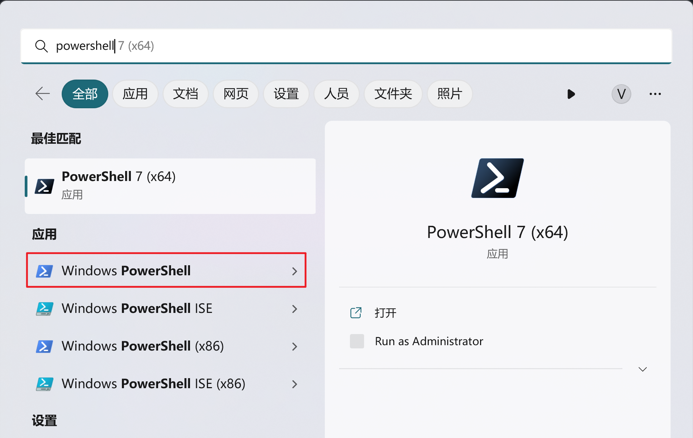
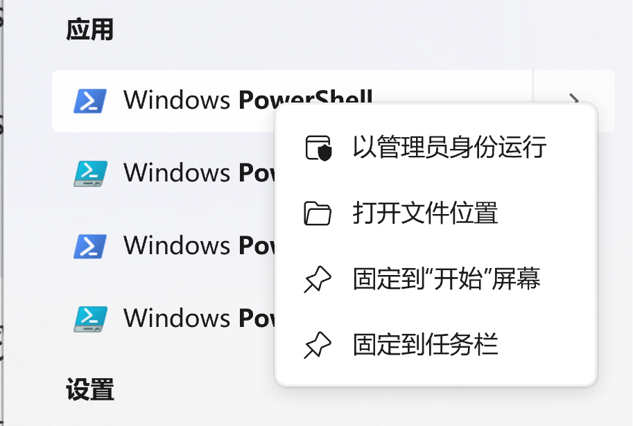
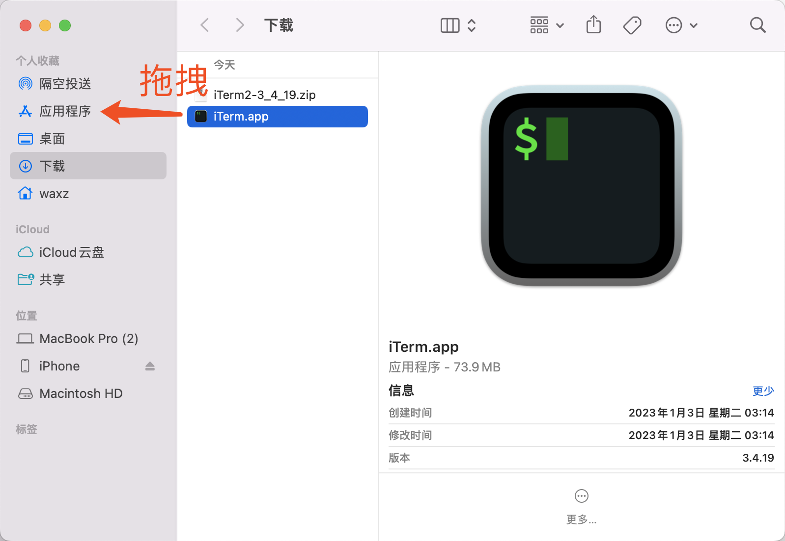
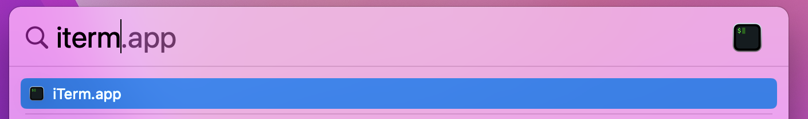
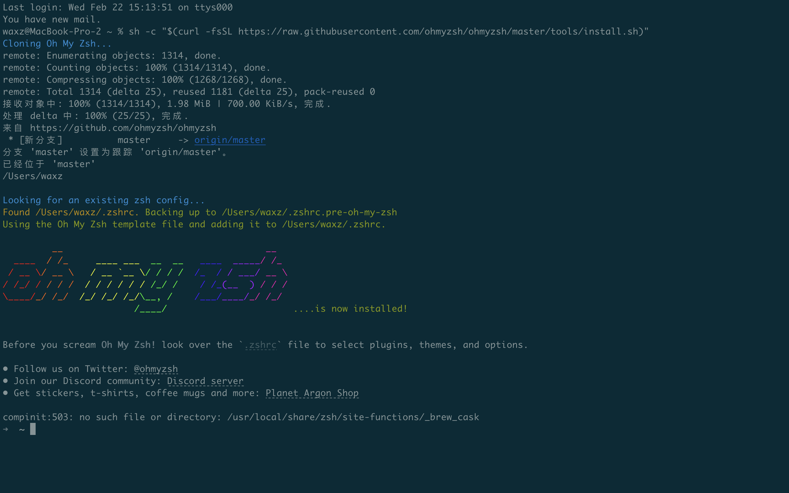
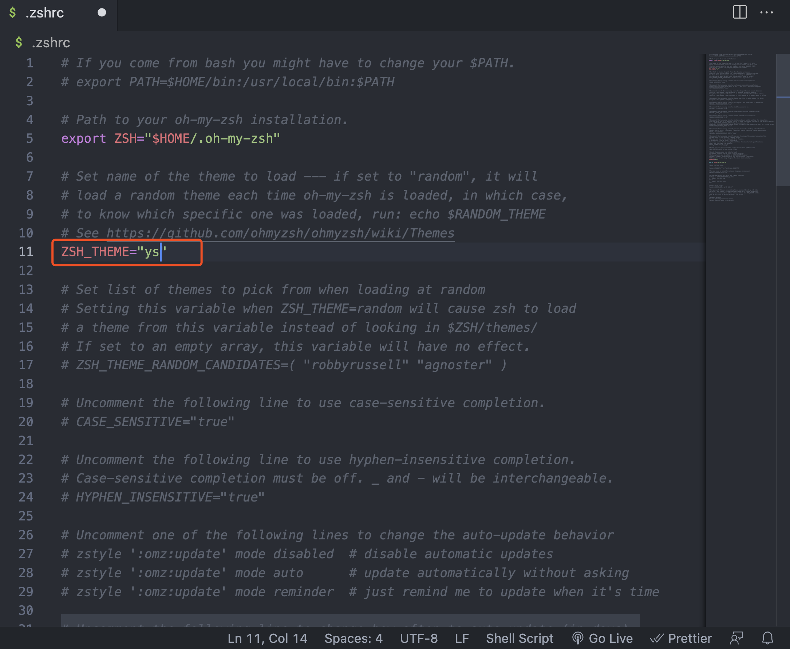

:::info 信息

[视频](https://www.bilibili.com/video/BV1Jo4y1Y7SC/?vd_source=4a888db8814702b2062fcaf2575be745)
:::

## 1.打开命令行

### 1.1.Windows

按键盘上的“Win”键，或点击Windows任务栏的“开始”按钮，然后输入powershell，即可找到Windows PowerShell。



普通权限和管理员权限：

直接点击是使用普通权限打开Windows  PowerShell;

右键点击，选择以管理员身份运行，是以管理员权限打开，很多时候在命令行遇到“Access”，“Permission”等报错信息，是因为命令行权限不够，此时，需要以管理员权限打开命令行，重新执行需要执行的命令。



### 1.2.Mac

#### 1.2.1.macOS系统自带的Terminal

macOS系统本身自带terminal命令行界面，参考李骏老师的编程课 https://github.com/neolee/pilot/blob/master/x1-setup.md#macos-%E7%AF%87

> macOS本质上是Unix，所以命令行界面是自带现成的，在macOS按⌘command+空格 键调出系统搜索框（大名叫Spotlight），输入terminal ↩︎，打开的窗口叫Terminal，这就是macOS的命令行环境

##### 在macOS按⌘command+空格 键调出系统搜索框（大名叫Spotlight）


##### 输入terminal后，按enter回车键


##### 这就是macOS自带的terminal终端工具


## 2.大小写敏感

大小写敏感是指大小写是否等价，比如A和a是不是一个东西？
windows大小写**不敏感**
MAC大小写**敏感**


## 3.路径分隔符

电脑中的文件夹是有层级关系的，在命令行中，表现为路径。
相邻的层级用一个分隔符分隔。
在Windows系统中，路径分隔符是反斜杠（\），而在MAC系统中，路径分隔符是正斜杠（/）。


## 4.切换路径

```powershell
cd path
```


## 5.创建目录

```powershell
mkdir
```


## 6.查看路径下的文件

```powershell
ls
```

## 7.查看当前路径
``` powershell
pwd
```


## 8.打开当前目录

Windows:

```powershell
start .
```

Mac:


```shell
open .
```


## 9.相对路径和绝对路径

> 绝对路径：指的是以根目录（根据操作系统不同，根目录也不同）为起点，引用某一文件或目录的完整路径。
> 
> 相对路径：指的是相对于当前目录的路径，不需要以根目录为起点，而是以当前所在的目录为起点。

绝对路径，到底在电脑上的哪个位置？相对路径，相对于当前路径，对一个路径的表示。

`.`表示当前路径；
`..`表示上一级路径。


------


:::tip 提示

**新手可以选项**，可以先用系统自带的terminal工具，开始编程学习。
:::


#### 1.2.2.替代系统自带的Terminal：iTerm2

[iTerm2](https://iterm2.com/)是一个在macOS系统的免费开源终端软件。相较于自带的Terminal，iTerm2提供了更多的特性，包括支持多tab窗口，分屏，快速搜索，自动补全命令，有丰富多样的主题可供定制使用

##### iTerm2的下载安装

###### 从官网下载安装[iTerm2](https://iterm2.com/),在官网点击download会下载一个zip文件


###### zip文件下载到了用户的下载目录，双击解压zip文件会在该目录出现macOS可执行文件iTerm.app，再将iTerm.app拖拽到用户的应用程序目录，这样就完成了iTerm2的安装



###### 在macOS按⌘command+空格 键调出Spotlight，输入iTerm即可打开iTerm.app



##### Oh My Zsh的安装配置(可选)

###### 说明
在macOS系统里，iTerm2和系统自带的Terminal都是可以执行Shell的终端应用软件。
bash和zsh是我们常说的Shell，Shell作为一个单词，它是“壳”的意思，蛋壳，坚果壳。
之所以叫壳，是为了和计算机的“核”来区分，用Shell是表示“为使用者提供的操作界面”。Shell也泛指所有为用户提供操作界面的程序，主要分为两类：命令行（CLI=Command Line Interface）与图形界面（GUI=Graphical User Interface）。
但是通常情况下，我们在聊Shell的时候，其实都是聊命令行CLI界面。

> bash全称为Bourne-Again Shell，在macOS系统的二进制文件位置为/bin/bash，在以往的macOS系统的shell都默认使用bash。

> Zsh即Z shell，Zsh对Bourne shell做出了大量改进，会比bash能好用很多。在macOS系统的二进制文件位置为/bin/zsh。从2019年起，macOS的默认Shell从bash改为Zsh

Oh My Zsh 是在macOS系统平台上，用于管理Zsh配置的框架，它提供了一系列的插件和主题来提升命令行使用时的体验，非常建议配置下Oh My Zsh

###### 下载安装Oh My Zsh

在iTerm2终端上输入sh -c "$(curl -fsSL https://raw.githubusercontent.com/ohmyzsh/ohmyzsh/master/tools/install.sh)"



###### 安装完成后，你想修改Oh My Zsh的配置，可以修改~/.zshrc文件，添加你需要的插件，主题等。在这里我把~/.zshrc文件里的ZSH_THEME改为ys主题，这个主题会展示更多命令信息，比如当前目录是什么，git的状态，时间等



