:::tip 提示

本内容为**新手可选项**，需要参与内容共创的人，该内容是必选项，新手可以在后续逐步上手后，回过头来再学习此部分内容，另外，本内容目前处于早期草稿阶段，需要共创参与者使用与反馈。

注意：以下步骤中使用的所有命令都需要在 `Terminal`（终端）进行操作。
如果你对 `Terminal` 不熟悉，请参考共创文档 [使用命令行](./p0-4-cli.md)
:::

:::info 信息

[视频](https://www.bilibili.com/video/BV1S54y1w7XN/?vd_source=4a888db8814702b2062fcaf2575be745)
:::

## 1.安装Git

### 1.1.Windows

**方式一**：访问：[Git - 下载地址](https://git-scm.com/download/win)，如下图，选择“64-bit Git for Windows Setup”下载安装。

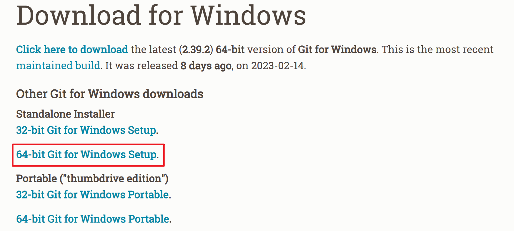


**方式二**：如果已经安装了 scoop 的话，可以直接在 PowerShell 里使用命令：`scoop install git`.


**检查是否成功安装**


命令行如果输入`git --version`后有返回 git 版本，表示安装成功


### 1.2.Mac

> Mac的Git安装待补充


## 2.为Github配置SSH登录

### 2.1.Windows

1. 生成ssh key

   在PowerShell中执行：

   ```powershell
    ssh-keygen -t ed25519 -C "你的github邮箱地址"
   ```

   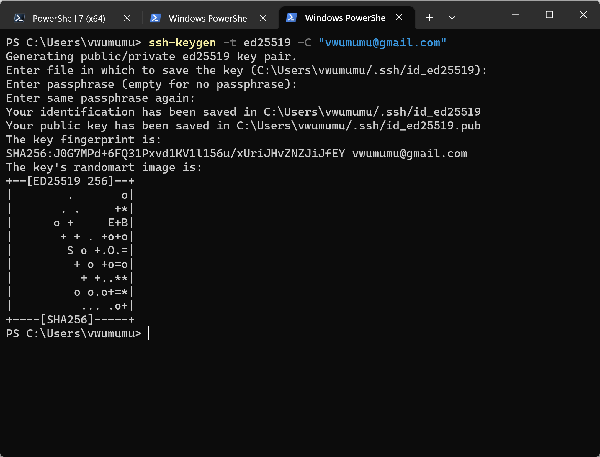

2. 复制ssh公钥的信息：

   在PowerShell中执行下面的命令，然后复制`ssh-ed25519 XXXXXX vwumumu@gmail.com`这一整段内容

   ```
   cat ~/.ssh/id_ed25519.pub
   ```

   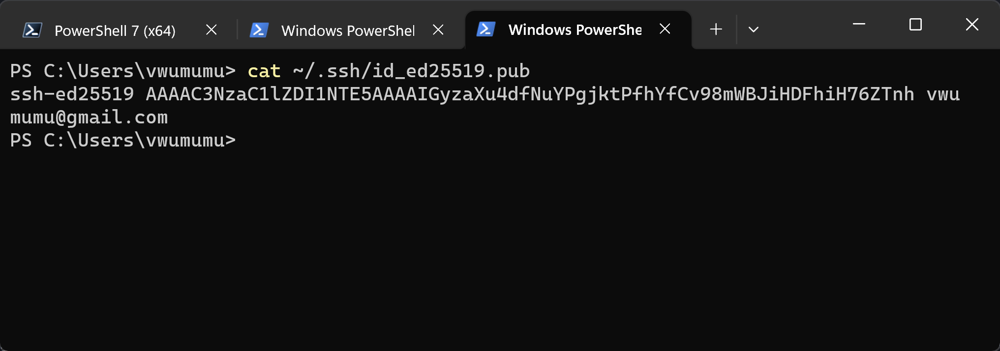

3. 将公钥信息，配置到Github中，点击“Add SSH Key”，然后输入密码完成添加：

   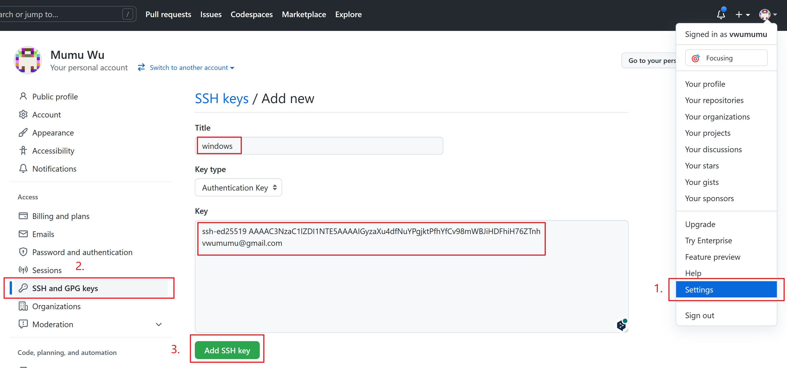

4. 然后Git和Github的通信，就可以通过SSH进行了：

   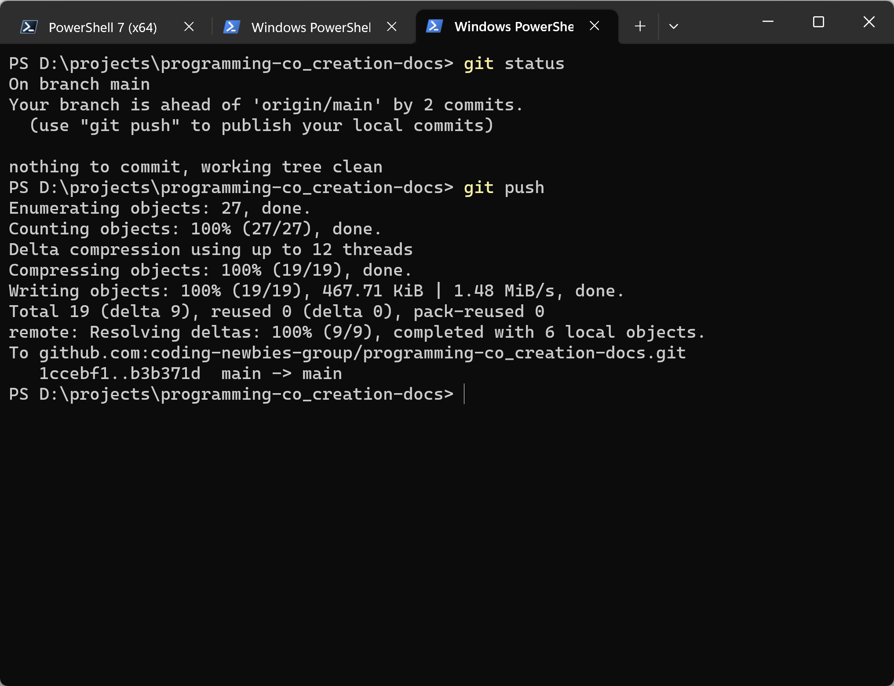

### 2.2.Mac

**1.验证本地电脑是否存在 SSH 密钥**
   1. 列出 `.ssh` 文件夹下的所有文件
      ```bash
      ls -al ~/.ssh 
      ```
   2. 检查返回的结果中是否已经存在公共 SSH 密钥
      默认情况下，Github 支持的公共密钥文件名有以下几种格式：
      - id_rsa.pub
      - id_ecdsa.pub
      - id_ed25519.pub

      &emsp;
      如果已经存在上面任何一个文件，那么，可以直接跳到步骤 4 继续操作
      如果不存在，需要从步骤 2 继续操作


**2.新建 SSH 密钥**

   1. 生成 SSH 密钥，使用你自己的 Github 邮件地址替换下面的示例邮箱地址。
        ```bash
        ssh-keygen -t rsa -b 4096 -C "your_email@example.com"
        ```
        &emsp;
   2. 确定密钥保存的目录（这里可以选择直接回车，保存到默认的位置）
        
        &emsp;
   3. 输入密码（可以选择直接回车，写密码需要写两遍）
        
        &emsp;
        按下两次回车之后，就在默认路径下生成了文件，分别是私钥和公钥。
        
   4. 可以使用 `ls -al ~/.ssh` 查看在`.ssh`目录下生成的两个文件。


**3.将 SSH 密钥添加到 ssh-agent**

   1. 在后台开启 ssh-agent
      ```bash
      eval $(ssh-agent -s)
      ```
   2. 使用 `ssh-add` 命令将密钥加载到 ssh-agent 中
      ```bash
      ssh-add ~/.ssh/id_rsa
      ```
      如果你在 步骤 2 中输入了密码，这里需要重新输入一次。
      &emsp;
      没有密码的话，会出现如下提示，说明已经成功添加：
      


**4.复制 SSH 密钥**

   1. 打开 id_rsa.pub 文件
      ```bash
      cat ~/.ssh/id_rsa.pub
      ```
      结果如下图：
      
      &emsp;
   2. 复制出现的文件内容（注意：不要多复制任何空格或换行符）
      PS：也可以通过下面命令行输入命令的方式，将 `~/.ssh/id_rsa.pub` 文件中的内容复制到系统剪切板：
      ```bash
      pbcopy < ~/.ssh/id_rsa.pub
      ```


**5.添加到你的 Github 账号**

   1. 登陆你的 Github 账号，在页面右上角找到 Settings(设置)
       
      &emsp;
   2. 在左边的菜单栏中找到 SSH 的设置
       
      &emsp;
   3. 点击上图中右边箭头所指向的 `new SSH key`
      &emsp;
   4. 按如下图所示，将 SSH 密钥粘贴到输入框中
       

**6.测试 SSH 连接**
   1. 输入以下命令，该命令会尝试 ssh 到 GitHub
      ```bash
      ssh -T git@github.com
      ```
      可能会看到这样的警告，输入 yes 然后按下回车即可：
      > The authenticity of host 'github.com (IP ADDRESS)' can't be established.
      > RSA key fingerprint is SHA256:nThbg6kXUpJWGl7E1IGOCspRomTxdCARLviKw6E5SY8.
      > Are you sure you want to continue connecting (yes/no)?

   &emsp;
   2. 如果正确按照上述所有步骤执行，那么会出现下面的提示，表示你可以通过 SSH 连接 Github 了
      > Hi [你的Github用户名]! You've successfully authenticated, but GitHub does not provide shell access. 

**参考**

> Github 官方文档：[connecting-to-github-with-ssh](https://docs.github.com/en/authentication/connecting-to-github-with-ssh)

## 3.将仓库Fork到自己的GitHub账户

1. 点击“programming-co_creation-docs”Github仓库页面中的”Fork“按钮：

   


2. 默认会将该仓库Fork到你个人的Github账号下，点击底部”Create fork“按钮，创建”Fork“：

   

3. 之后，会发现页面跳转到了自己的Github页面下的”programming-co_creation-docs“仓库：

   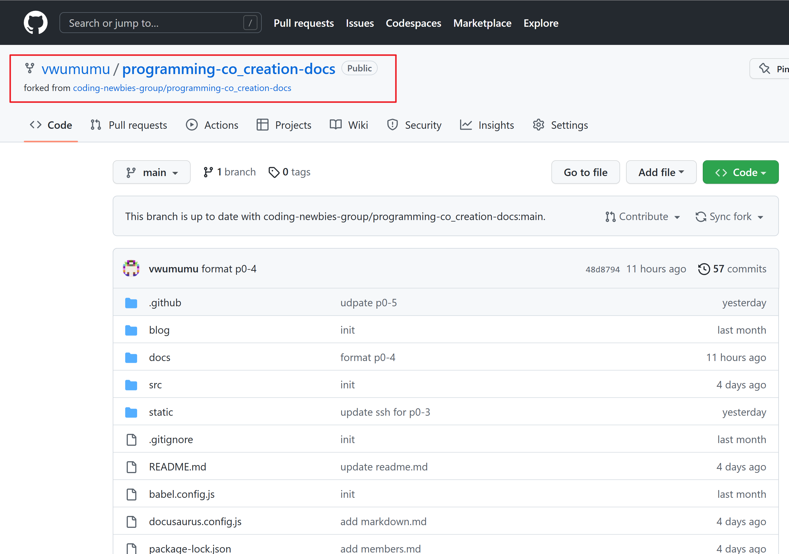


## 4.从自己的Github克隆知识库到本地

1. 点击自己Github账号下该仓库页面的”Code“——”SSH”，然后复制这个SSH地址，强调一下，地址是以git@开头，不是以Https开头的：

   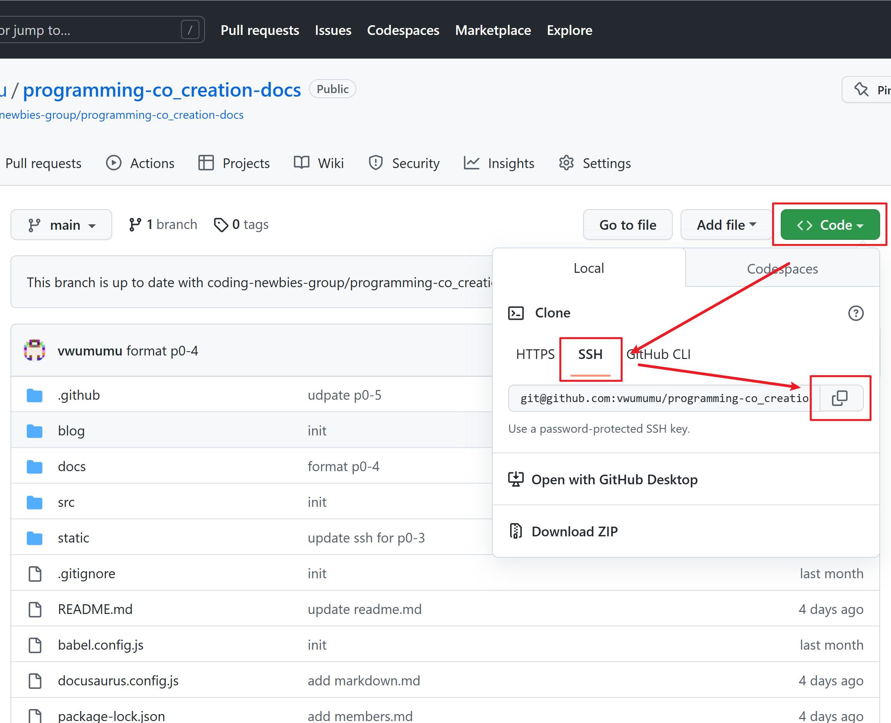

2. 在本地电脑上新建一个文件夹，比如`C:\projects`，然后执行下面的命令，即可在`C:\projects`文件夹内创建一个名为`programming-co_creation-docs`的文件夹，并将Github仓库的内容下载到该文件夹内：

   ```powershell
   git clone git@github.com:vwumumu/programming-co_creation-docs.git
   ```

   

3. 进入到`programming-co_creation-docs`文件夹，查看文件夹下有哪些文件，到这，这一步就可以完成了。

   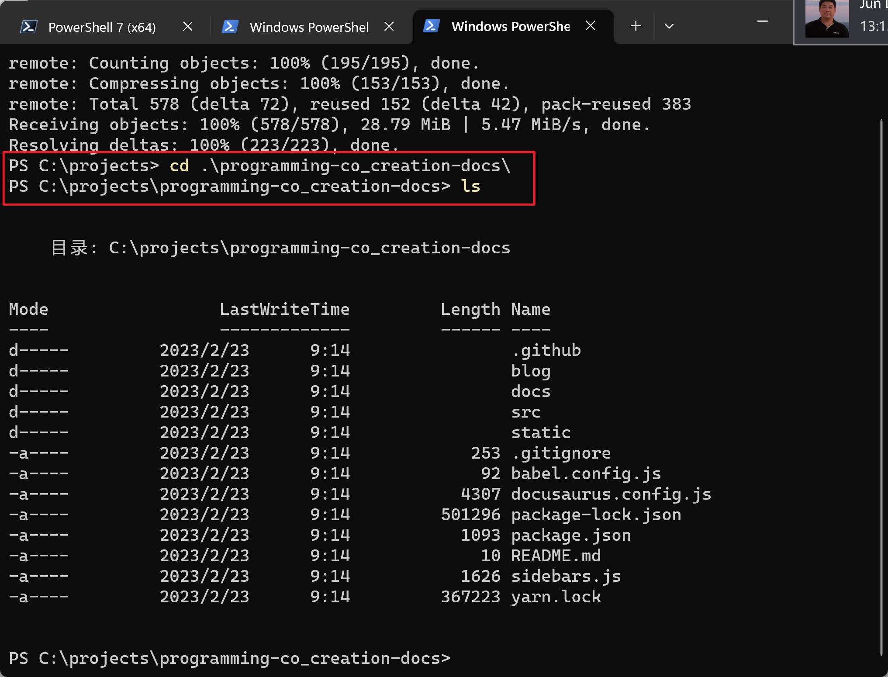

   

## 5.在本地修改内容

文档库中显示的文档都在`programming-co_creation-docs`内的`docs`文件夹内，之后就可以编辑这些文件夹内的Markdown格式的文件，参与共创。

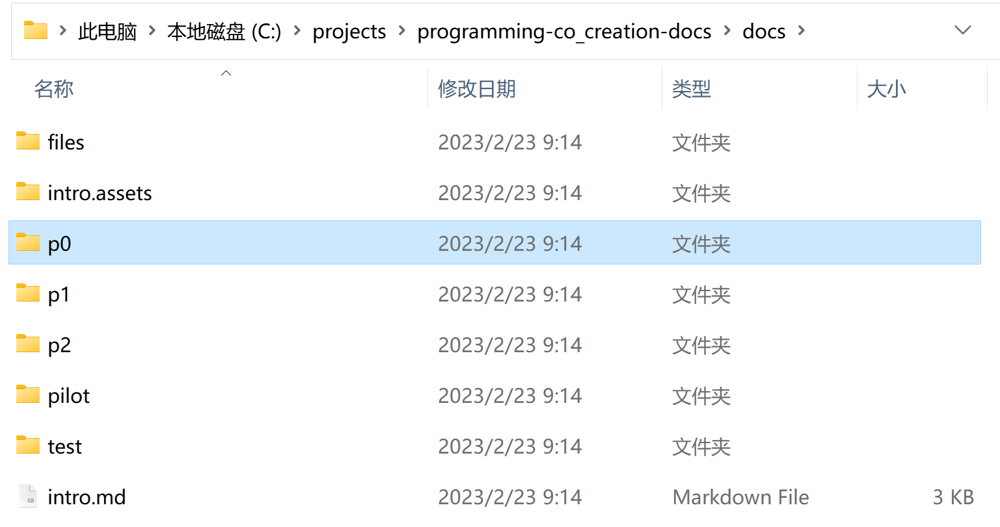

**下面是我通常的操作方式，供大家参考：**

1. 用`VSCode`打开`programming-co_creation-docs`文件夹，可以很方便的看到Markdown源码，也有目录的层级结构：

   在`programming-co_creation-docs`路径下执行`code .`

   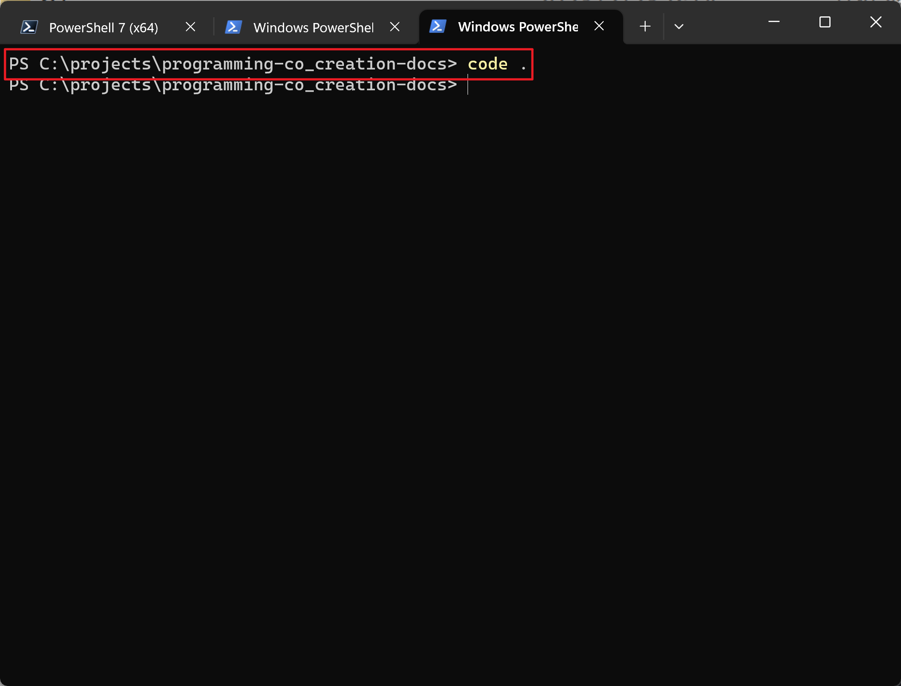

2. 然后，找到需要完善的文件，直接进行编辑，比如下面，为`docs/test/intro.md`，添加了`# 这是测试的内容`：

   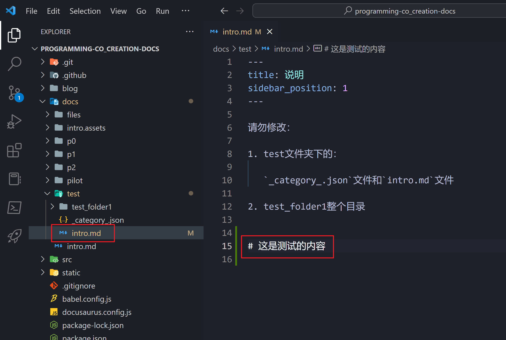

3. 又或者，可以右键点击文件，选择“Open in External App”，我安装了Typora，会用Typora打开Markdown文件进行编辑：

   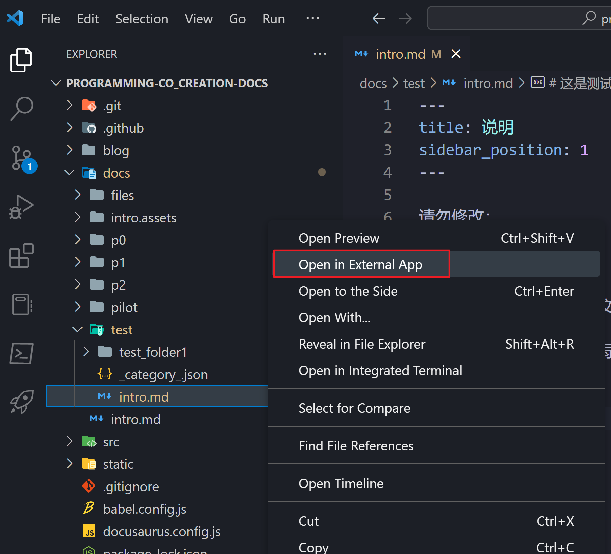

   

## 6.将本地内容提交到自己的Github仓库

当我们完成内容的修改后，就需要把自己本地的内容，提交到自己的Github仓库

1. 查看本地仓库的状态，我们可以看到红色的提示：modified（修改的），我们修改了`docs/test/intro.md`这个文件：

   ```
   git status
   ```

   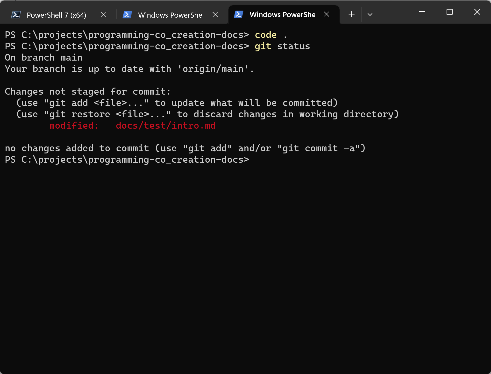

2. 执行`git add .`将更改提交给Git，执行`git commit -m "对这次提交的说明"`，添加对这次提交的说明信息：

   ```
   git add .
   git commit -m 'update intro.md'
   ```

   

3. 将本地的变更推送至自己的Github：

   ```powershell
   git push
   ```

   

4. 刷新自己的Github仓库，可以看到我们提交的备注信息：

   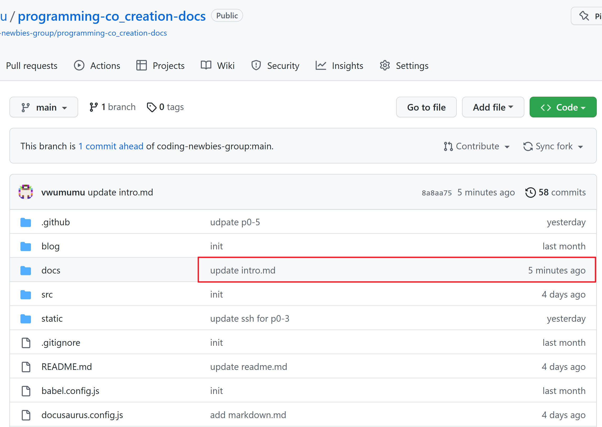

5. 找到文件，可以看到我们修改的内容：

   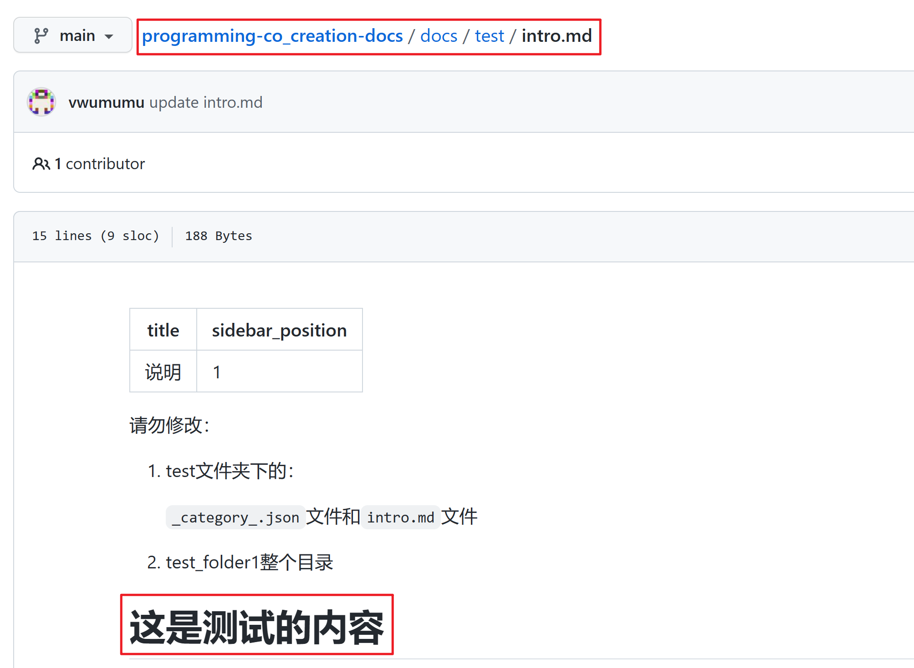


## 7.将自己的修改提交到共学共创仓库（Pull Request）

下一步，就是要将自己的仓库，提交给共学共创仓库，我们把这个过程叫“Pull Request”，简称PR

1. 点击自己仓库的“Pull requests”标签，点击右侧的“New pull request”按钮：

   

2. 确认提交的内容并提交；

   1.观察提交的方向，是从个人仓库向共学共创仓库；

   2.下面绿的内容就是我们刚才添加的内容，表示，这部分内容会被新增到共学共创仓库；

   3.确认好上面的信息，点击右侧绿色的“Create pull request”按钮创建提交。

   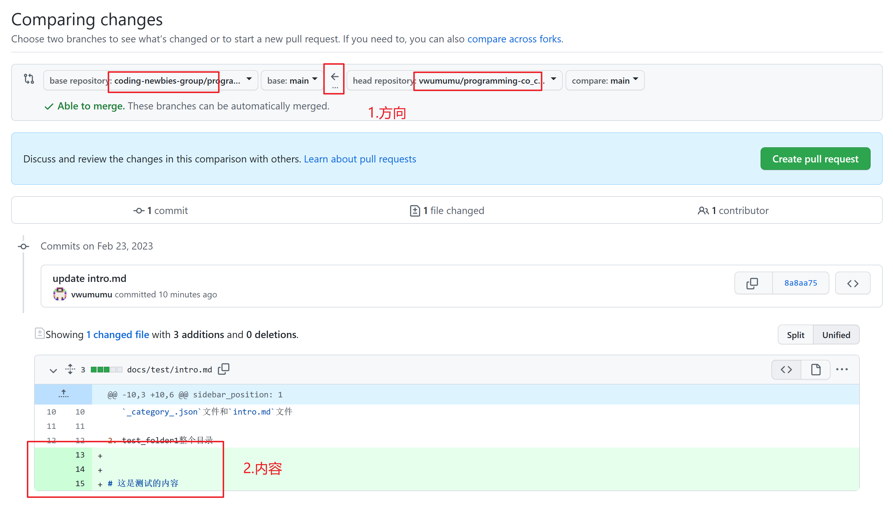

3. 添加一些说明信息，然后点击“Create pull request”，之后，就等待Mumu将提交的内容合并到共学共创仓库就可以了。

   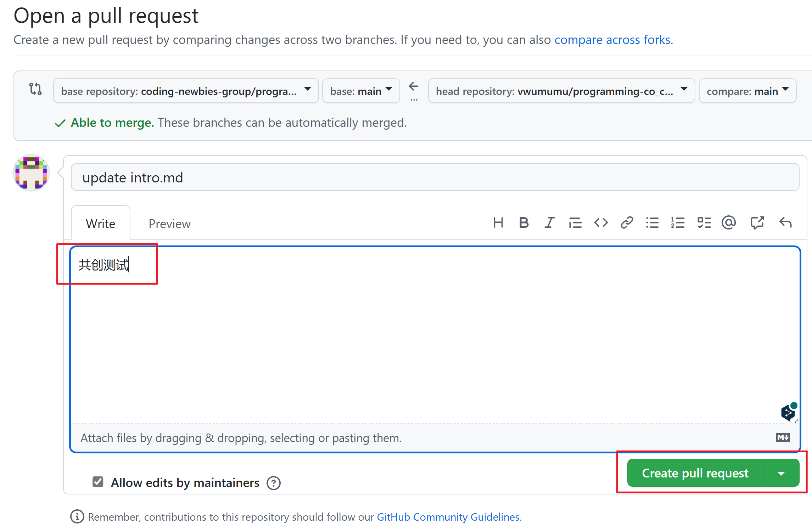

------

## 补充：

### 2.1.Windows

From 阿坦:

> Q:为什么要为 Github 配置 SSH 登录?
> A:为了可以使用 SSH 更方便（不需要输入账号密码）地从 Github 克隆仓库到本地磁盘，需要在 Github 配置 SSH key.
>
> Q:需要做什么？
> A:需要使用 SSH (Secure Shell) 在本地生成密钥对，然后把公钥粘贴到 Github 做配对。

**1.生成新的 SSH key.**

- 打开 Powershell

- 粘贴下面的文字，替换成你的GitHub电子邮件地址:

  ```powershell
  ssh-keygen -t ed25519 -C "your_email@example.com"
  ```

  当你被提示 "输入一个保存密钥的文件 "时，你可以按回车键来接受默认的文件位置。请注意，如果你以前创建过 SSH 密钥，ssh-keygen 可能会要求你重写另一个密钥，在这种情况下，我们建议创建一个自定义命名的 SSH 密钥。要做到这一点，请输入默认的文件位置，并用你的自定义密钥名称替换id_ssh_keyname。

- 在提示符下，输入一个安全口令。

**2.添加你的 SSH key 到 ssh-agent**

- 启动 ssh-agent

  ```bash
  # 以管理员身份打开 PowerShell, 把 ssh-agent 服务改为手动启动
  Get-Service -Name ssh-agent | Set-Service -StartupType Manual
  # 检查是否修改成功
  Get-Service ssh-agent | Select StartType
  # 启动 ssh-agent 到后台
  Start-Service ssh-agent
  # 检查一下服务是不是已经开始运行了
  Get-Service ssh-agent
  ```
  

- 将你的 SSH 私钥添加到 ssh-agent。如果你用不同的名字创建了你的密钥，或者你正在添加一个有不同名字的现有密钥，请将命令中的id_ed25519替换为你的私钥文件的名字。

  ```powershell
  ssh-add ~/.ssh/id_ed25519
  ```

- 添加 SSH key 到你的 Github 账号

  - 首先复制 SSH public key 到剪贴板

    如果你的SSH公钥文件的名称与示例代码不同，请修改文件名以符合你当前的设置。在复制你的密钥时，不要添加任何换行或空白。

    ```powershell
    clip < ~/.ssh/id_ed25519.pub
    # Copies the contents of the id_ed25519.pub file to your clipboard
    ```

  - 在 Github 任意页面右上角，点击你的头像，然后点 Settings（设置）

    

  - 在侧边栏选择 Access（访问），点 **SSH and GPG keys**.

  - 点 **New SSH key** 或者 **Add SSH key**.

    

  - 在 "Title" 里，为新 key 添加描述

  - 选择 key 类型（通常保持默认的 authentication 就好）

  - 把你的 public key 粘贴到 "Key" 区域里

    

  - 点击 **Add SSH key**.

    

  - 如果有提示，请确认你在GitHub上的账户访问权限。
